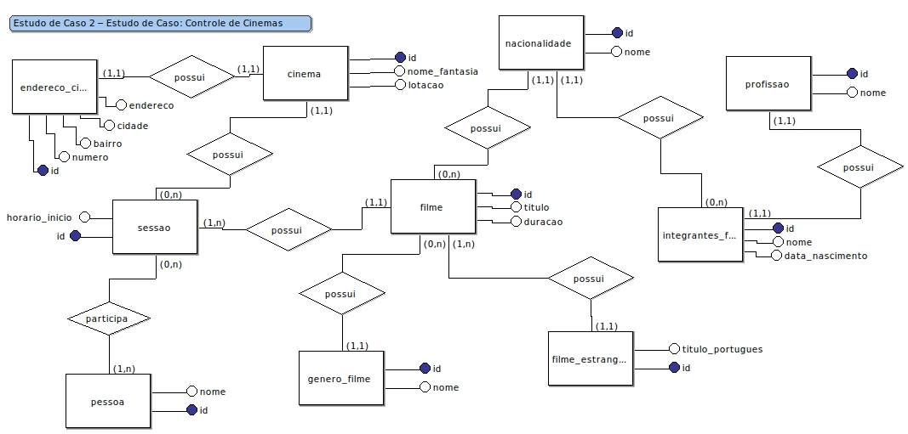
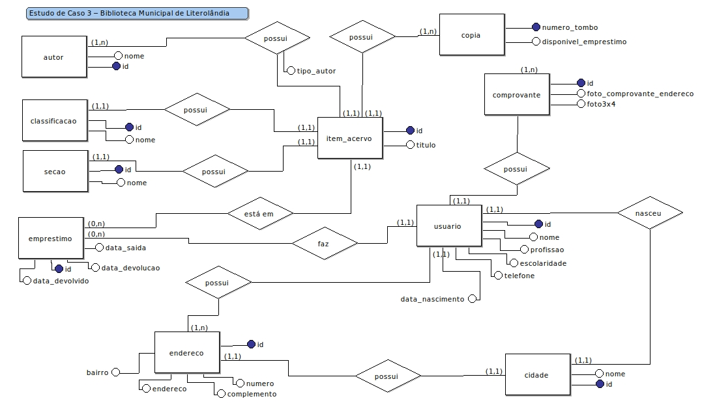
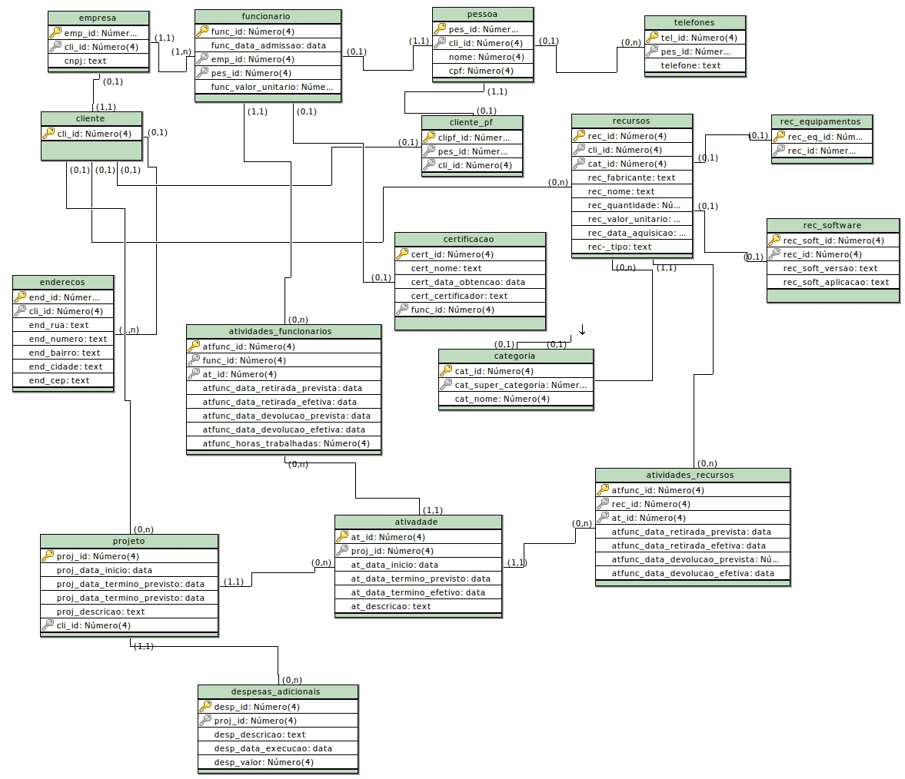
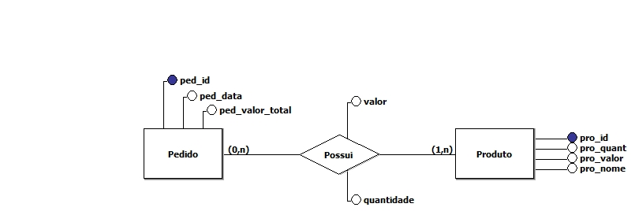
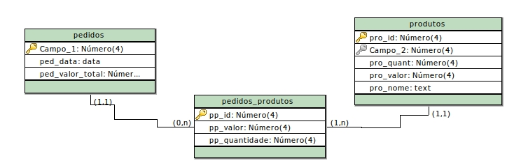
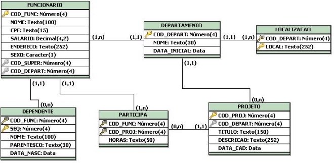

# entity-relationship-diagrams

Database class assignments by prof. Juliana Forin Pasquini Martinez.
Answered by me, Maicon Mauricio.
Diagrams made with BrModelo and draw.io.

## Exercícios de Modelagem – Prática 1

### Instruções:
- Realizar o Modelo Conceitual (Relacionamentos e atributos (cardinalidades mínimas e máximas).
- Postar as imagens de cada estudo de caso até 01/09/2021
- Pode ser realizado em grupo de até 3 alunos.

## Estudo de Caso 1 – Controle de frequência de empregados 
Deseja-se projetar a base de dados de um sistema de controle de frequência de empregados de uma organização. Através de um diagrama entidade-relacionamento, deve ser modelada esta base de dados.

A base de dados não deve conter redundância de dados. O modelo ER deve ser representado com a notação vista em aula. O modelo deve apresentar, ao menos, entidades, relacionamentos, atributos, especializações, identificadores e grau de cardinalidade mínima e máxima. Não utilizar atributos multi-valorados.

A base de dados deve manter dados sobre empregados. Cada empregado é identificado por um código e tem um nome. Para fins de controle de frequência, há dois tipos de empregados. Um tipo de empregado é o que tem horário livre. Empregados deste tipo podem trabalhar em qualquer horário do dia. Para estes empregados basta saber quantas horas devem trabalhar ao longo do mês, bem como, qual é o menor período em horas que devem trabalhar. Exemplificando, há alguns empregados que não devem trabalhar menos que duas horas cada vez.

Empregados de segundo tipo devem trabalhar em horários fixos. A semana de trabalho do empregado deste tipo está organizada em turnos. Um turno (1) inicia em um dia da semana e um horário e (2) termina em um dia da semana (possivelmente diferente do de início) e em um horário. O empregado pode trabalhar dois turnos no mesmo dia da semana. Cada dia da semana é identificado por um código (algo como "d", "s", . . . ) e tem um nome (algo como "domingo", "segunda-feira", . . . ). (Adaptado - Heuser, 2008).

# Answer


## Estudo de Caso 2 – Estudo de Caso: Controle de Cinemas

Após várias reuniões com os futuros usuários do sistema, relacionamos uma série de regras do negócio e que serão a base para o desenvolvimento do diagrama ER:

- A empresa de distribuição possui vários cinemas em diversas localidades;
- Cada cinema possui uma identificação única, um nome fantasia, um endereço completo, incluindo rua, avenida, bairro, município, estado e sua capacitação de lotação;
- Os filmes podem ser dos mais variados gêneros e nacionalidade;
- Cada filme é registrado com um título original, e se for filme estrangeiro, possuirá também o título em português, o gênero, sua duração e seu país de origem, informações sobre os atores que compõem seu elenco, e o seu diretor. Existirá um único diretor para cada filme;
- Alguns cinemas apresentam mais de um filme em cartaz, sendo, nesses casos, sessões alternadas com um filme e outro;
- As sessões possuem horários que variam de acordo com a duração do filme, havendo sempre um intervalo de aproximadamente 15 minutos entre elas;
- Os atores de um filme podem, obviamente, atuar em diversos filmes, assim como o diretor de um filme pode também ser ator nesse filme ou, ainda mais, ser ator em outro filme. Um ator possui as seguintes características: um número de identificação, um nome, uma nacionalidade e uma idade;
- As sessões de cinema devem ter seu público registrado diariamente, para que se permita a totalização dos assistentes quando o filme sair de cartaz, ou qualquer instante.
Nas reuniões de levantamento, os usuários nos passaram as seguintes necessidades de informação:
- Apuração do publico por município, por cinema e por sessão de cada cinema;
- Permitir uma forma de consulta, que dado um determinado ator, sejam localizados os cinemas onde estão em cartaz os filmes em que esse ator atua;
- Em quais cinemas está sendo exibido um determinado gênero de filme;
- Em quais cinemas estão sendo exibidos filmes nacionais.

# Answer



## Estudo de Caso 3 – Biblioteca Municipal de Literolândia 

A comissão municipal de cultura da cidade de Literolândia, uma cidade de 40.000 habitantes no interior de São Paulo, se reuniu para discutir alguns assuntos relacionados a cultura na cidade. Nessa reuniao foram levantados alguns problemas nas rotinas da biblioteca municipal, e foi entao votado por unanimidade pela informatização do cadastro de acervo da biblioteca e dos processos de aquisição e empréstimos.

A biblioteca conta hoje com um acervo de 30.000 itens, classificados em: Livros, Revistas, Fitas de video, Hemeroteca, etc., cada item do acervo possui um número variavel de cópias, nem todas as cópias estao disponíveis para emprestimo pois, existem exemplares raros que so podem ser consultados na biblioteca. Os livros do acervo podem ter um ou mais autores sendo que somente um autor é considerado como o autor principal, os outros sac) co-autores.

Qualquer cidadão Literolandense pode usar a biblioteca para consulta, porém para retirar livros ele deve ser cadastrado como usuario da biblioteca, o cadastro consiste em preencher uma ficha com seus dados pessoais (nome, data de nascimento, local de nascimento, enderego, bairro, telefone, profissao e escolaridade), e fornecer um comprovante de enderego e uma foto 3X4 para a confecção da uma carteira de identificagao de usuario. Os emprestimos de itens do acervo sac) registrados em um livro de emprestimos que contem o nome do usuario, o item emprestado, a cópia que foi emprestada (identificada pelo número de tombo que é único para cada cópia), a data de saida, a data de devolução, quando o usuario devolve o item sao registrados no mesmo livro, os dias de atraso e o valor da multa, caso ele entregue com atraso. Nao existem limites de empréstimos em aberto por usuário, mas o prazo para devolução é de 7 dias. Se o usuário devolver é cobrada uma taxa diaria de multa por dia de atraso.

Para melhorar a busca ao acervo os usuarios devem ter a possibilidade de busca ao cadastro por: Título do item do acervo, autor ou assunto. Para ajudar o trabalho das bibliotecárias deve ser emitido um relatorio diario com os empréstimos em atraso. Como analise estatística do use da biblioteca devem ser emitidos relatOrios com o total de empréstimos no mês por tipo de item do acervo, por item do acervo e por faixa etaria de idade de usuário.

# Answer



---

# 1º Questionário de Avaliação de BD -1ºSem. de 2021 (Parte 2) – 4 Pontos

#####

Instruções:

- Insira as respostas das questões neste documento.

- Atividade individual e com consulta.

- Insira o seu nome neste arquivo.

## 1. (1,5) Crie o Diagrama Entidade-Relacionamento do estudo de caso a seguir:

**Estudo de caso: Consultoria Informática**

Uma consultoria em sistemas de informação deseja informatizar o controle dos projetos desenvolvidos para seus clientes e os recursos que estes projetos consomem, bem como os valores das despesas de sua execução. Para isto, solicitou a sua equipe de analistas de sistemas que realizassem o levantamento de requisitos, o qual resultou no que segue:

- Os clientes, normalmente empresas, devem ser cadastrados, informando seu nome, endereço e a lista de pessoas que nestes trabalham e serão os contatos durante a realização do projeto. Cada contato deve informar diversos telefones.

- Devem ser cadastrados, também, os recursos de que a consultoria dispõe para executar os projetos. Estes recursos podem ser de 2 tipos: funcionários e recursos técnicos, os quais podem, por sua vez, serem equipamentos ou softwares.

- Cada recurso é identificado por um número sequencial e possui um valor unitário, utilizado no cálculo das despesas.

- Os funcionários possuem uma matrícula única na consultoria, um nome e uma data de admissão, bem como uma lista de certificações e a data de sua obtenção. Uma certificação é a obtenção de um certificado, com determinado nome, junto a um fabricante de software ou equipamento.

- Os recursos técnicos (softwares ou equipamentos) possuem um fabricante com determinado nome, uma descrição e uma data de aquisição.

- Os softwares possuem, ainda, um nome, uma versão e uma aplicação, que pode ser: C–Cliente/Servidor, W-Web, ou O–Outras. Além disto, cada software pertence a uma categoria denominada. As categorias possuem uma estrutura hierárquica, tipo: a categoria &quot;linguagem de programação&quot; se divide em &quot;compiladas&quot;, interpretadas&quot; ou de &quot;script&quot;, e assim por diante.

- Cada projeto é cadastrado, identificando seu cliente. Os projetos são numerados seqüencialmente, possuindo descrição, data de início, de término previsto e de término efetivo.

- Um projeto é composto por diversas atividades, cada qual possuindo um número dentro deste projeto. Uma atividade possui descrição, data de início previsto, de início efetivo, de término previsto e de término efetivo.

- Cada atividade de um projeto pode alocar diversos funcionários, sendo necessário armazenar informações históricas sobre estas alocações. Uma alocação de funcionário marca a data e hora da retirada prevista e efetiva do funcionário e da devolução prevista e efetiva deste, bem como a quantidade de horas trabalhadas. A quantidade de horas trabalhadas nesta alocação, multiplicada pelo valor unitário do recurso funcionário, resulta no valor gasto nesta alocação com esse funcionário.

- Assim como atividades de um projeto alocam funcionários, o projeto aloca diversos recursos técnicos.

- Além das despesas representadas pela alocação de funcionários, os projetos possuem despesas adicionais. Cada despesa adicional possui uma data de execução, um valor e uma descrição.

# Answer



## 2. (1,0) Mapear o modelo conceitual a seguir para o modelo lógico relacional, levando em consideração as regras explicadas em sala. **É obrigatório criar o diagrama**.



# Answer



## 3. (1,5) Utilize a Normalização como ferramenta de Projeto, demonstre cada passo da normalização a partir do passo 2FN. A tabela NN e passo 1 FN estão prontos. Explique o que ocorre nos passos da 1FN para 2FN e da 2FN para 3FN.

**Estudo de Caso 2 - PEDIDO**

**Código do Vendedor: 1791 Nome do Vendedor: Anibal da Silva**

**Prazo de Entrega: 20 Dias**

| **Num.**** Ped. **|** Clien-te **|** Endereço ****Cidade/UF** | **CGC** | **IE** | **Cód Prod.** | **Unid** | **Quant.** | **Desc.** | **Val.**** Unit **|** Tot. Prod. **|** Tot do Ped.** |
| --- | --- | --- | --- | --- | --- | --- | --- | --- | --- | --- | --- |
| 3443 | TCA.. | R.Meira | 11111111 | 11111111 | 45 | L | 20 | Álcool | 5,00 | 100,00 | 170,00 |
| 3443 | TCA.. | R.Meira | 11111111 | 11111111 | 130 | M | 2 | Tecido | 20,00 | 40,00 | 170,00 |
| 3443 | TCA.. | R.Meira | 11111111 | 11111111 | 35 | Kg | 30 | Farinha | 1,00 | 30,00 | 170,00 |
| 2610 | Lopes | R.127 | 23232323 | 343434 | 45 | L | 50 | Álcool | 5,00 | 250,00 | 1660,00 |
| 2610 | Lopes | R.127 | 23232323 | 343434 | 78 | kg | 47 | Cimen-to | 30,00 | 1410,00 | 1660,00 |
| 9756 | HTZ.. | Trv. Ney | 45636352 | 484747 | 90 | L | 60 | Cola | 3,00 | 180,00 | 400,00 |

**Não Normalizada**

> PEDIDO (ped\_num, cli\_cod, cli\_nome, cli\_endereco, cli\_cgc, cli\_ie, ite\_total\_valor, ped\_total, ven\_cod, ven\_nome, ped\_prazo\_entrega (prod\_cod, pro\_unidade, pro\_quantidade, pro\_descricao, pro\_valor\_uni))

1ª FN

> PEDIDO (ped\_num, cli\_cod, cli\_nome, cli\_endereco, cli\_cgc, cli\_ie, ped\_total, vem\_cod, ven\_nome, ped\_prazo\_entrega)

> ITEM-PEDIDO (ped\_num, prod\_cod, pro\_unidade, pro\_quantidade, pro\_descricao, pro\_valor\_uni, ite\_total\_valor)

# Answer 

## Não Normalizada

```
PEDIDO (
    ped_num, cli_cod, cli_nome, cli_endereco, cli_cgc, cli_ie, ite_total_valor,
    ped_total, ven_cod, ven_nome, ped_prazo_entrega (
        prod_cod, pro_unidade, pro_quantidade, pro_descricao, pro_valor_uni
))
```
## 1ª FN

SEPARA GRUPO COM INFORMAÇÕES REPETIDAS.

```
PEDIDO (ped_num, cli_cod, cli_nome, cli_endereco, cli_cgc, cli_ie, ped_total, vem_cod, ven_nome, ped_prazo_entrega)

ITEM-PEDIDO (ped_num, prod_cod, pro_unidade, pro_quantidade, pro_descricao, pro_valor_uni, ite_total_valor)
```

## 2º FN

REMOVE DEPENDÊNCIA FUNCIONAL PARCIAL

```
CLI (cli_cod, cli_nome, cli_endereco, cli_cgc, cli_ie)

PEDIDO (ped_num, ped_total, vem_cod, ped_prazo_entrega, cli_cod)

ITEM-PEDIDO (ped_num, ite_total_valor, prod_cod)

PRODUTO (prod_cod, pro_unidade, pro_quantidade, pro_descricao, pro_valor_uni)
```

## 3º FN

REMOVE DEPENDÊNCIA FUNCIONAL TRANSITIVA

```
VENDEDOR(ven_cod, ven_nome)

PEDIDO (ped_num, ped_total, vem_cod, ped_prazo_entrega, cli_cod)

ITEM-PEDIDO (ped_num, ite_total_valor, prod_cod)

PRODUTO (prod_cod, pro_unidade, pro_quantidade, pro_descricao, pro_valor_uni)
```


---
## Prática02

**Utilizando os conceitos apresentados em aulas, criar o esquema físico para o modelo lógico apresentado abaixo.  Utilizar a técnica de Trigramação para nomear os atributos.** 

#### Observações:

- Ao criar as tabelas nomear as *constraints* 
- Logar no Oracle com o usuário criado no item 3: **USER\_BD senha: ALUNO** 



#### Regras de negócio:

> FUNCIONARIO.NOME = Preenchimento obrigatório 
> 
> FUNCIONARIO.CPF = Não pode haver duas instâncias com mesmo valor no campo CPF. FUNCIONARIO.SALARIO = O salário dos funcionários não pode ser menor que 1000,00. FUNCIONARIO.SEXO = Só aceitar os caracteres “M” ou “F”. 
> 
> FUNCIONARIO.COD\_SUPER = coluna usada para definição do auto-relacionamento DEPARTAMENTO.NOME =  Preenchimento obrigatório 
> 
> DEPENDENTE.NOME = Preenchimento obrigatório 
> 
> DEPENDENTE.PARENTESCO = Preenchimento obrigatório 
> 
> DEPENDENTE.PARENTESCO = Só aceitar valores dentro do conjunto (“PAI”,”MÃE”, “IRMAOS”,”FILHO”) PROJETO. TITULO = Preenchimento obrigatório 
> 
> PROJETO.DATA\_CAD = Data de cadastro dos projetos com valor padrão igual à data do dia. A função que retorna > a data do dia no oracle é ***Sysdate***. 

# Answer (Oracle)

    CREATE TABLE DEPARTAMENTO(
    COD_DEPART NUMBER,
    NOME VARCHAR2(100) NOT NULL,
    DATA_INICIAL DATE,
    CONSTRAINT PK_DEPARTAMENTO PRIMARY KEY (COD_DEPART)
    )
    //

    CREATE TABLE LOCALIZACAO(
    COD_LOC NUMBER,
    COD_DEPART NUMBER,
    LOC_LOCAL VARCHAR2(252),
    CONSTRAINT PK_LOCALIZACAO PRIMARY KEY (COD_LOC),
    CONSTRAINT FK_LOCALIZACAO_COD_DEPART
        FOREIGN KEY (COD_DEPART) REFERENCES DEPARTAMENTO(COD_DEPART)
    )
    //

    CREATE TABLE FUNCIONARIO(
    COD_FUNC NUMBER,
    FUNC_NOME VARCHAR2(100) NOT NULL,
    FUNC_CPF VARCHAR2(15),
    FUNC_SALARIO DECIMAL(4,2),
    FUNC_ENDERECO VARCHAR2(252),
    FUNC_SEXO CHAR,
    COD_SUPER NUMBER,
    COD_DEPART NUMBER,
    CONSTRAINT UK_FUNCIONARIO_FUNC_CPF UNIQUE (FUNC_CPF),
    CONSTRAINT CK_FUNCIONARIO_FUNC_SEXO CHECK (FUNC_SEXO IN ('M', 'F')),
    CONSTRAINT CK_FUNCIONARIO_FUNC_SALARIO CHECK (FUNC_SALARIO > 1000),
    CONSTRAINT PK_FUNCIONARIO PRIMARY KEY (COD_FUNC),
    CONSTRAINT FK_FUNCIONARIO_COD_DEPART
        FOREIGN KEY (COD_DEPART) REFERENCES DEPARTAMENTO(COD_DEPART),
    CONSTRAINT FK_FUNCIONARIO_COD_SUPER
        FOREIGN KEY (COD_SUPER) REFERENCES FUNCIONARIO(COD_FUNC)
    )
    //

    CREATE TABLE DEPENDENTE(
    COD_DEP NUMBER,
    COD_FUNC NUMBER,
    DEP_SEQ NUMBER,
    DEP_NOME VARCHAR2(100) NOT NULL,
    DEP_PARENTESCO VARCHAR2(30) NOT NULL,
    DEP_DATA_NASC DATE,
    CONSTRAINT CK_FUNCIONARIO_DEP_PARENTESCO
        CHECK (DEP_PARENTESCO IN ('PAI','MAE', 'IRMAO', 'FILHO')),
    CONSTRAINT PK_DEPENDENTE PRIMARY KEY (COD_DEP),
    CONSTRAINT FK_FUNCIONARIO_COD_FUNC
        FOREIGN KEY (COD_FUNC) REFERENCES FUNCIONARIO(COD_FUNC)
    )
    //

    CREATE TABLE PROJETO(
    COD_PROJ NUMBER,
    COD_DEPART NUMBER,
    PROJ_TITULO VARCHAR2(150) NOT NULL,
    PROJ_DESCRICAO VARCHAR2(252),
    PROJ_DATA_CAD DATE DEFAULT SYSDATE,
    CONSTRAINT PK_PROJETO PRIMARY KEY (COD_PROJ),
    CONSTRAINT FK_PROJETO_COD_DEPART
        FOREIGN KEY (COD_DEPART) REFERENCES DEPARTAMENTO(COD_DEPART)
    )
    //

    CREATE TABLE PARTICIPA(
    COD_FUNC NUMBER,
    COD_PROJ NUMBER,
    PART_HORAS VARCHAR2(50),
    CONSTRAINT PK_PARTICIPA PRIMARY KEY (COD_FUNC,COD_PROJ),
    CONSTRAINT FK_PARTICIPA_COD_FUNC
        FOREIGN KEY (COD_FUNC) REFERENCES FUNCIONARIO(COD_FUNC),
    CONSTRAINT FK_PARTICIPA_COD_PROJ
        FOREIGN KEY (COD_PROJ) REFERENCES PROJETO(COD_PROJ)
    )
    //
